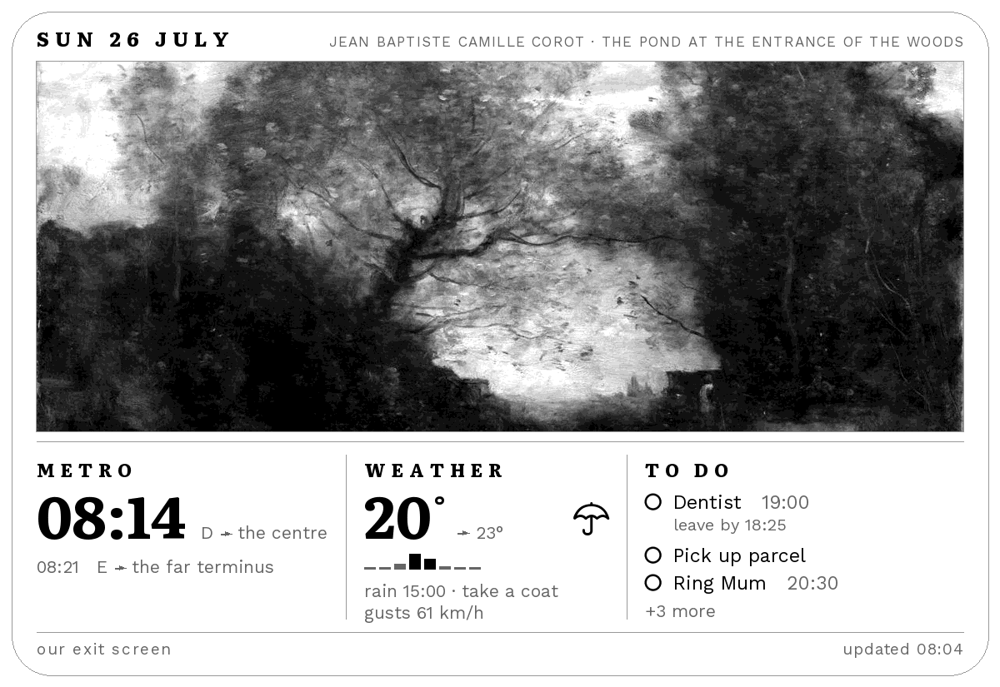

# exitscreen

An e-ink screen by my front door that tells me what I need to know before
walking out. The next metro I can actually catch, whether to take a coat, what's
on the shared to-do list, and a painting.



<sub>Sample data, not my actual feed — real departures and a real to-do
list say more about where someone lives than a demo image needs to.
Regenerate with `py tools/readme_image.py`.</sub>

It refreshes every five minutes but only redraws when something's actually
changed. E-ink holds its image with the power off, so most of the time it just
sits there costing nothing.

Built for one flat and two people, so a fair amount is specific to us — one
metro stop, one city, one weekly timetable. Those bits live in a config file
that isn't in this repo; see [Making it yours](#making-it-yours).

## What's on it

**Metro** — the next two departures from my home stop, live. Only ones I can
actually reach: it's a six minute walk to the platform, so anything sooner gets
skipped. A train you'll miss is worse than no train at all. When the feed can't
be reached it says **"feed unavailable"** rather than showing a dash that reads
as "no trains".

**Weather** — from Open-Meteo. Temperature and today's high, whether to take an
umbrella, and a bar chart of the next eight hours' rain chance that only appears
when rain is actually coming.

**To do** — a shared TickTick list, filtered to today. If a task has a time and a
`#40m` tag saying how long it takes to get there, it gets a second line: `leave
by 18:25`. That tag is door-to-door minutes, and I know that number better than
any API does.

**Commute** — on a day with class, it works backwards from the start time to the
latest connecting bus that still gets me there in time, then to the metro that
makes it. Shown as one line: `metro 11:38 · bus 12:01`.

**Art** — a public domain painting a day from the Cleveland Museum of Art,
greyscaled and cropped to fit. Same painting all day, picked by date. If one
looks bad on the panel, `py tools/art_veto.py --today` kills it for good.

## Running it

```bash
py tools/preview.py            # sample data, no network, opens a viewer
py tools/preview.py --live     # real data
python run.py --dry-run        # the real thing, without touching the panel
python run.py                  # render and push to the panel
```

On the Pi, cron runs `run.py` every five minutes from 06:00 to 22:00, with a
clear-and-redraw at 05:59. There's also an `@reboot` entry that waits for NTP
first — the Pi has no clock of its own and boots thinking it's some time in the
past, which made it filter out every departure as "already gone".

## Making it yours

Two files, neither of them in this repo:

```bash
cp .env.example .env                             # TickTick credentials
cp assets/settings.example.json assets/settings.json   # your stop and timetable
```

`.env` holds the TickTick token; run `py tools/ticktick_auth.py` to mint one.
`assets/settings.json` holds your metro stop, coordinates and weekly schedule.

**Both are gitignored on purpose.** The token is a credential, and a home stop
plus a weekly timetable is a public statement of when a specific person leaves a
specific building. Neither belongs in a repository. `settings.py` fails with an
instruction rather than falling back to someone else's commute.

The connecting-service timetable is generated from the national GTFS feed:

```bash
py tools/build_bus_timetable.py path/to/gtfs-nl.zip
```

## The hardware

A Waveshare 9.7" e-Paper HAT — ED097TC2 driven by an IT8951, 1200×825, sixteen
greys — on a Raspberry Pi 3 A+. Connected with jumper wires rather than stacked,
so the board sits flat behind the frame.

**VCOM is printed on your panel's own ribbon cable.** Mine is −1.81; yours will
differ, and using the wrong value degrades the display.

## Where things are

```
src/exitscreen/
  frame.py     builds the whole 1200x825 image. Pure: data in, image out
  theme.py     every number worth changing — geometry, greys, fonts
  settings.py  loads the gitignored personal config
  metro.py     live departures
  weather.py   Open-Meteo
  todo.py      TickTick
  commute.py   which metro and which bus make today's class
  museum.py    Cleveland, and picking the day's painting
  art.py       what to show when the painting can't be fetched
  icons.py     weather glyphs from a bundled font; arrows drawn by hand
  eink.py      256 greys down to 16, and the frame hash
  display.py   the only file that imports the panel driver
tools/         previewers, a spacing auditor, art veto, a Pi doctor,
               and the thing that renders the image above
deploy/        crontab, wifi watchdog, and a one-command Pi rebuild script
```

`BACKLOG.md` is the running notes — what's left, what was tried, what broke, and
why several things are the way they are.

## Four things that'll bite you

**Rendering has to be deterministic.** `run.py` hashes the image and skips the
panel if nothing changed, so anything time-dependent is decided in the data
modules and handed to `frame.py` as a finished string. `frame.py` never learns
what time it is. An early version put `now()` in the footer, which made every
frame differ and refreshed the panel every five minutes forever.

**Never replace a good frame with an empty one.** If every feed fails, `run.py`
declines to push — including the daily clear, which once blanked the panel for a
whole day after a night of bad wifi.

**A 200 isn't necessarily an answer.** The transit feed is a free community
server and will happily return an empty or wrong-shaped body. That used to get
cached over good data. `carries_departures()` checks the shape first.

**Pillow's text layout is pinned to `BASIC`** so a laptop and the Pi shape text
identically. The Pi has libraqm and Windows doesn't; without this the preview
quietly stops predicting what the panel will do.

## Credits

Fonts are Literata and Work Sans, weather glyphs are Erik Flowers' Weather Icons,
all OFL and bundled with their licences. Paintings are CC0 from the Cleveland
Museum of Art. Transit data from [OVapi](http://v0.ovapi.nl/) and the Dutch
national GTFS feed. Panel driver is
[GregDMeyer/IT8951](https://github.com/GregDMeyer/IT8951).

MIT licensed — see [LICENSE](LICENSE).
